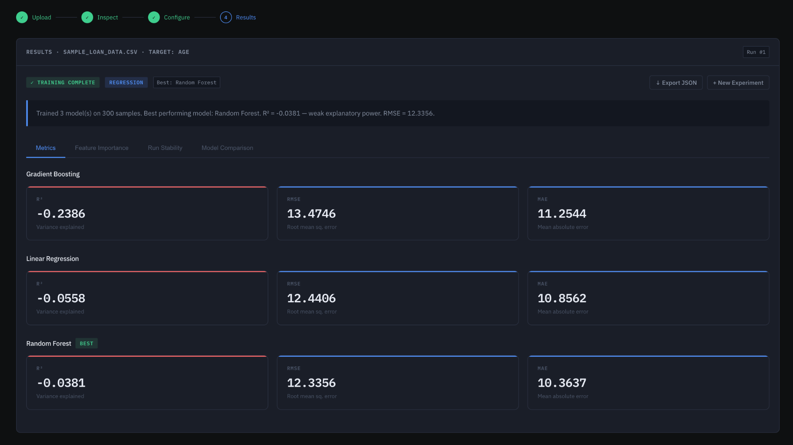

# ML Experimentation Platform

A full-stack system for **structured experimentation with supervised machine learning models**, providing dataset validation, reproducible preprocessing pipelines, model training, and comparative evaluation.



---

## Overview

This project implements an end-to-end workflow for tabular ML tasks, centered around **reproducibility, comparability, and pipeline correctness**.

It supports:

- Dataset ingestion with schema inference and validation
- Deterministic preprocessing via composable pipelines
- Parallel training across multiple estimators
- Standardized evaluation using task-appropriate metrics
- Persistent experiment tracking for cross-run comparison


---

## Tech Stack

- **Backend**: Flask (Python)
- **ML / Data**: scikit-learn, pandas, numpy
- **Frontend**: React, Recharts, Axios
- **Storage**: SQLite (metadata) + local file system (datasets)
- **API**: REST (JSON)

---

## Core Features

- Dataset ingestion and profiling (schema, missing values, types)
- Automated preprocessing pipelines (scaling, encoding, splitting)
- Multi-model training (Linear, Logistic, Random Forest, Gradient Boosting)
- Evaluation metrics  
  - Regression: RMSE, MAE, R²  
  - Classification: Accuracy, Precision, Recall, F1
- Experiment tracking with persistent history
- Leaderboard ranked by model performance
- Feature importance visualization
- Run stability tracking across repeated experiments
- Export results as structured JSON

---

## Workflow

1. Upload dataset  
2. Configure experiment (target, models, preprocessing)  
3. Train models  
4. Evaluate metrics  
5. Compare runs and analyze results  

---

## Project Structure

```
backend/
  ├── routes/              # API endpoints
  ├── services/            # Dataset + experiment orchestration
  ├── ml/                  # Preprocessing, training, evaluation
  └── models/              # SQLite helpers

frontend/
  ├── components/          # UI components
  ├── pages/               # Views (dashboard, history, leaderboard)
  └── hooks/               # Experiment state management
```

---

## Setup

### Requirements
- Python 3.11+
- Node.js 18+

### Backend

```bash
cd backend
python3 -m venv venv
source venv/bin/activate
pip install -r requirements.txt
python app.py
```

API: http://localhost:5000/api

### Frontend

```bash
cd frontend
npm install
npm start
```

App: http://localhost:3000

---

## Example Use Case

- Upload a tabular dataset  
- Train Random Forest and Gradient Boosting models  
- Compare accuracy or RMSE  
- Analyze feature importance  
- Track consistency across multiple runs  

---

## Key Design Decisions

- Pipeline-based preprocessing  
  Uses ColumnTransformer and Pipeline to prevent data leakage and ensure reproducibility  

- Separation of concerns  
  Backend handles ML logic, frontend handles visualization and interaction  

- Experiment tracking  
  All runs stored in SQLite for comparison and reproducibility  

- Custom React hook (useExperiment)  
  Encapsulates async experiment workflow and state management  

---

## Future Improvements

- Hyperparameter tuning (GridSearchCV)
- SHAP-based explainability
- PostgreSQL for multi-user support
- Dockerized deployment
- Automated test suite

---

## One-Line Summary

Train and evaluate machine learning models with built-in preprocessing, tracking, and performance comparison.
